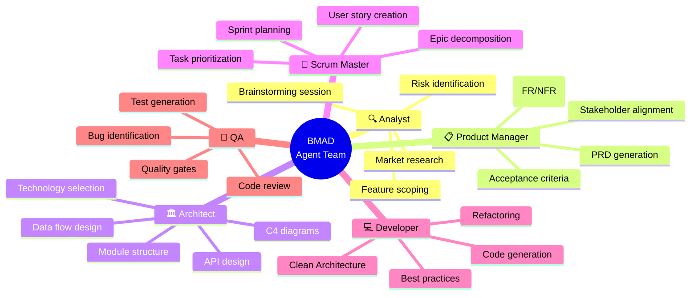
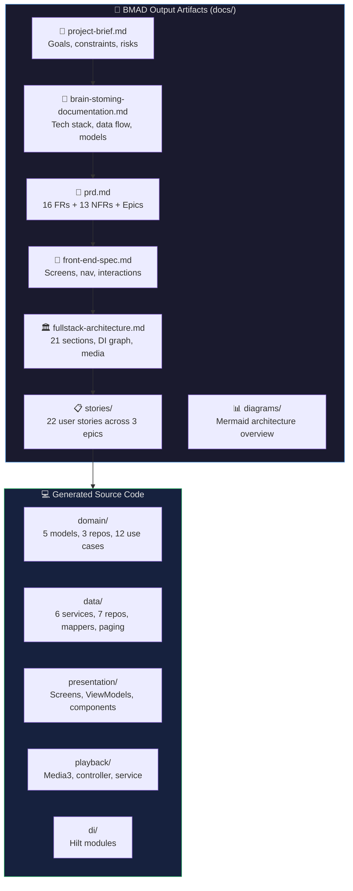
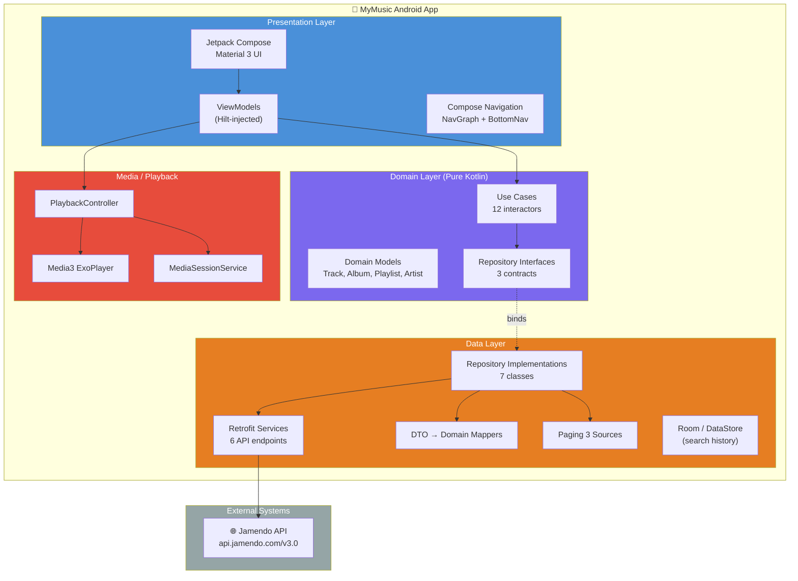
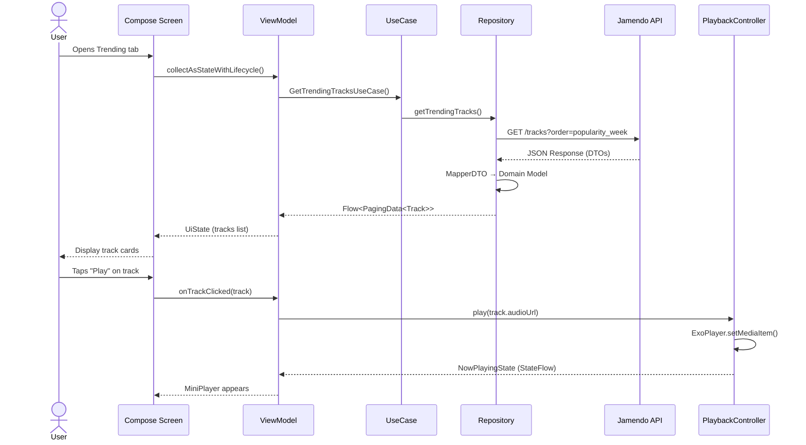
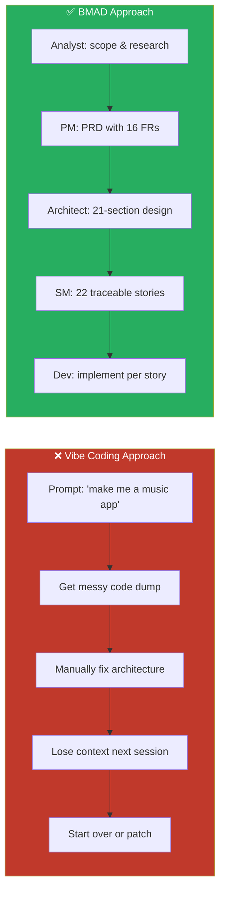
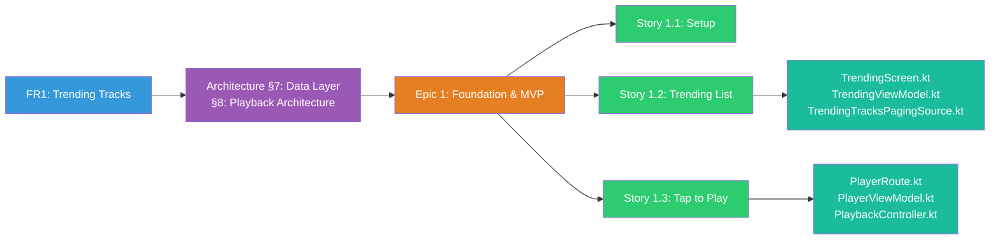
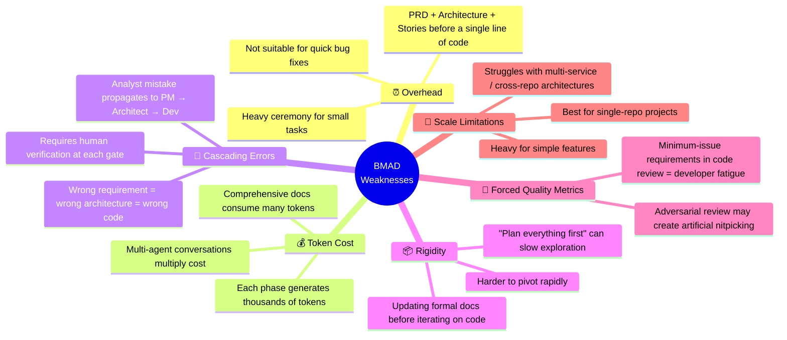
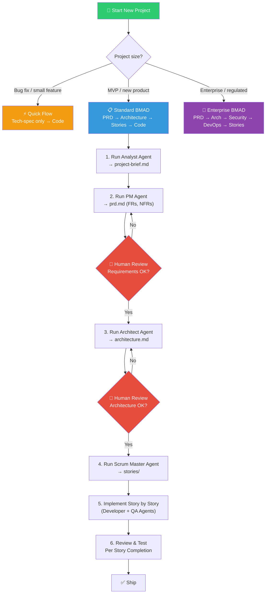
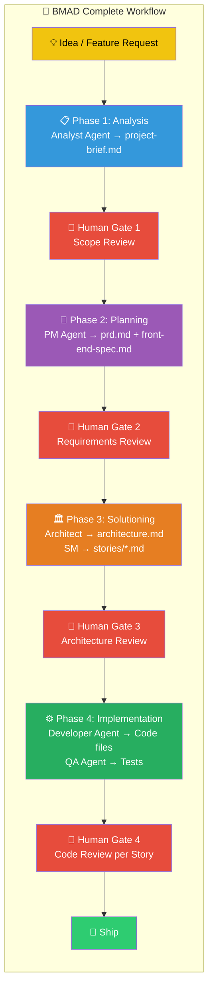

# AI Utilization Case Report — BMAD Method for MyMusic App

---

| Field | Details |
|---|---|
| **Date of Submission** | 2026.04.15 |
| **Name (Department)** | Duy LQ (Multimedia 1P) |

---

## Case Title

**Building MyMusic Android App Using BMAD (Breakthrough Method for Agile AI-Driven Development)**

---

## Utilization Scale

- ✅ **Full transformation of development workflow**
- From manual planning + ad-hoc AI prompting → structured, agent-orchestrated, documentation-first AI development lifecycle

---

## Case Category

- **Productivity tool development (Agent-based development workflow)**
- **Design & Documentation**
  - General design (architecture, data model/schema, API/interface definition)
  - Design document generation (class diagram, requirement specification)
  - Code-based summarization or explanation
- **Coding**
  - Code generation (app, business logic implementation)
  - Refactoring (modularization, Clean Architecture separation)
- **Review**
  - Static analysis / potential defect inspection
  - Code change summary
- **Testing**
  - Unit test generation (planned)
  - Test automation environment setup (planned)

---

## Tools Used

Cursor IDE, Cline (VS Code), Antigravity (Google DeepMind)

## Models Used

Claude-4.5-Sonnet, Claude Opus 4.6, GPT-5

---

## Case Details

### 1. What is BMAD Method?

BMAD (**Breakthrough Method for Agile AI-Driven Development**) is an open-source framework that brings structure, governance, and repeatability to AI-assisted software development. Instead of "vibe coding" (ad-hoc prompting), it treats AI as a **disciplined team member** following an agile process with clear roles.

#### 1.1 BMAD vs. Traditional "Vibe Coding" — Why It Matters

```
┌─────────────────────────────────────────────────────────────────────┐
│                    THE PROBLEM WITH VIBE CODING                     │
├─────────────────────────────────────────────────────────────────────┤
│                                                                     │
│   Developer ──prompt──> AI ──code──> ???                            │
│                                                                     │
│   ⚠️ No requirements doc    ⚠️ No architecture review              │
│   ⚠️ Context lost between    ⚠️ Inconsistent quality               │
│      sessions                ⚠️ "Black box" codebase               │
│   ⚠️ No traceability        ⚠️ Hard to onboard new members        │
│                                                                     │
└─────────────────────────────────────────────────────────────────────┘
                              │
                              ▼
┌─────────────────────────────────────────────────────────────────────┐
│                     BMAD METHOD SOLUTION                            │
├─────────────────────────────────────────────────────────────────────┤
│                                                                     │
│   Human + AI Agents → PRD → Architecture → Stories → Code → QA     │
│                                                                     │
│   ✅ Full documentation     ✅ Architecture-first design            │
│   ✅ Persistent context     ✅ Consistent, auditable output         │
│   ✅ Version-controlled     ✅ Easy onboarding & handoff            │
│      artifacts              ✅ Traceable decisions                  │
│                                                                     │
└─────────────────────────────────────────────────────────────────────┘
```

#### 1.2 Core Concept — Specialized AI Agent Team (C4 Context Diagram)

```mermaid
C4Context
    title BMAD Method — System Context (C4 Level 1)

    Person(dev, "Developer", "Human developer who guides the process")

    System_Boundary(bmad, "BMAD Agent Team") {
        System(analyst, "Analyst Agent", "Brainstorming, research, scoping")
        System(pm, "Product Manager Agent", "PRD creation, requirements")
        System(architect, "Architect Agent", "System design, tech decisions")
        System(sm, "Scrum Master Agent", "User stories, acceptance criteria")
        System(developer, "Developer Agent", "Implementation by stories")
        System(qa, "QA Agent", "Testing, code review")
    }

    System_Ext(ide, "AI IDE", "Cursor / Cline / Claude Code")
    System_Ext(llm, "LLM Provider", "Claude / GPT / Gauss")
    System_Ext(repo, "Version Control", "Git Repository")

    Rel(dev, bmad, "Guides & reviews")
    Rel(bmad, ide, "Integrated into")
    Rel(bmad, llm, "Powered by")
    Rel(bmad, repo, "Artifacts stored in")
```

#### 1.3 BMAD Workflow — Phase-Based Development (C4 Container Diagram)

```mermaid
flowchart LR
    subgraph Phase1["📋 Phase 1: ANALYSIS"]
        A1["🧠 Brainstorming<br/>Research & Scoping"]
        A2["📝 Project Brief<br/>Goals & Constraints"]
    end

    subgraph Phase2["📐 Phase 2: PLANNING"]
        B1["📄 PRD Creation<br/>Requirements (FR/NFR)"]
        B2["🎨 UX Specification<br/>Screens & Flows"]
        B3["✅ PRD Review<br/>Checklist Validation"]
    end

    subgraph Phase3["🏗️ Phase 3: SOLUTIONING"]
        C1["🏛️ Architecture Design<br/>Layers, Modules, DI"]
        C2["📊 Data Model<br/>Entities & APIs"]
        C3["📋 Epic Breakdown<br/>→ User Stories"]
    end

    subgraph Phase4["⚙️ Phase 4: IMPLEMENTATION"]
        D1["🔨 Story-by-Story<br/>Development"]
        D2["🔍 Code Review<br/>Per Story"]
        D3["🧪 Testing<br/>Unit + Integration"]
    end

    Phase1 --> Phase2 --> Phase3 --> Phase4

    style Phase1 fill:#4A90D9,color:#fff
    style Phase2 fill:#7B68EE,color:#fff
    style Phase3 fill:#E67E22,color:#fff
    style Phase4 fill:#27AE60,color:#fff
```



#### 1.4 Agent Roles — Detailed Responsibilities



---

### 2. How We Applied BMAD to Build MyMusic App

#### 2.1 Project Overview

MyMusic is a **modern Android music app** built 100% in Kotlin with Jetpack Compose, Hilt DI, MVVM + Clean Architecture, powered by the Jamendo API.

#### 2.2 BMAD Artifact Flow for MyMusic (C4 Component Diagram)



#### 2.3 MyMusic App Architecture (C4 Container Level)



#### 2.4 Detailed Data Flow (C4 Component Level)



#### 2.5 Codebase Statistics

| Metric | Value |
|---|---|
| Total Kotlin source files | 102 |
| Documentation files (docs/) | 80 |
| User stories written | 22 (across 3+ epics) |
| Domain models | 5 (Track, Album, Artist, Playlist, SearchFilter) |
| Repository interfaces | 3 |
| Use cases | 12 |
| Retrofit services | 6 |
| Repository implementations | 7 |
| Presentation screens | 8+ |
| Architecture layers | 4 (Presentation, Domain, Data, Media) |
| **Test files** | **0** ⚠️ |

---

### 3. Why Should You Use BMAD? — Evidence & Proof

#### 3.1 Comparison: Vibe Coding vs. BMAD for Same Project



#### 3.2 Concrete Benefits Proven by MyMusic

| Benefit | Evidence from MyMusic |
|---|---|
| **Clean Architecture from Day 1** | 4-layer separation (presentation/domain/data/media) enforced by architecture doc before coding |
| **No Context Loss** | 80 docs serve as persistent context; AI agents always know project state |
| **Traceable Decisions** | Every feature maps to: PRD FR → Architecture Section → Epic → Story → Code |
| **Consistent Quality** | All 102 source files follow the same patterns (Hilt DI, StateFlow, Mapper pattern) |
| **Easy Onboarding** | New developer reads project-brief.md → PRD → architecture → starts coding any story |
| **Scalable Complexity** | Started with Trending Tracks MVP, expanded to 3 epics + 22 stories without architectural churn |

#### 3.3 Documentation-First Traceability Map



---

### 4. Weaknesses & Limitations of BMAD (Honest Assessment)

#### 4.1 Summary of Weaknesses



#### 4.2 Detailed Weakness Analysis for MyMusic

| Weakness | Impact on MyMusic | Mitigation |
|---|---|---|
| **Overhead for simple tasks** | Adding a simple color change requires checking PRD/Architecture alignment | Use BMAD "Quick Flow" track for minor fixes |
| **No test files generated** | Despite QA agent role, **0 test files exist** ⚠️ | BMAD guides test *strategy* but doesn't enforce test *creation* — needs manual discipline |
| **Token consumption** | ~80 docs generated = significant API cost | Use local/cheaper models for doc generation, premium models for architecture decisions |
| **Cascading errors** | If Jamendo API endpoint assumed incorrectly in PRD → wrong architecture → wrong code | Human review gate at each phase transition is critical |
| **Single-repo focus** | Works well for MyMusic (monorepo), but wouldn't scale if we split into microservices | Use BMAD Enterprise track for multi-repo scenarios |

---

### 5. Current Testing Status — Critical Gap ⚠️

```
┌─────────────────────────────────────────────────────────────────────┐
│                      TESTING STATUS: MyMusic                        │
├─────────────────────────────────────────────────────────────────────┤
│                                                                     │
│   📁 app/src/test/       → ❌ Directory does NOT exist              │
│   📁 app/src/androidTest/ → ❌ Directory does NOT exist             │
│   📄 *Test.kt files       → ❌ ZERO test files found                │
│                                                                     │
│   Unit Test Coverage:        0%                                     │
│   Integration Test Coverage: 0%                                     │
│   UI Test Coverage:          0%                                     │
│                                                                     │
│   ⚠️  BMAD produced architecture-doc-level test strategy            │
│       (docs/fullstack-architecture.md §17) but NO actual            │
│       test implementation was generated.                            │
│                                                                     │
│   Documented Test Strategy (from Architecture §17):                 │
│   • Unit tests: mappers, use cases, repos with fakes               │
│   • Instrumented: ViewModels with coroutine testing                 │
│   • UI tests: Compose key flows (Trending → Play, Download)        │
│                                                                     │
│   → This is a known BMAD limitation: method produces excellent      │
│     test plans but relies on human discipline to execute them.      │
│                                                                     │
└─────────────────────────────────────────────────────────────────────┘
```

**Recommendation**: Prioritize generating tests using AI for:
1. `TrackMapper` (DTO → Domain) — easiest, highest value
2. `GetTrendingTracksUseCase` — business logic validation
3. `TrendingViewModel` — UI state management

---

### 6. BMAD Best Practice Guide — For Your Next App

#### 6.1 Quick Start Checklist



#### 6.2 Key Rules for Success

1. **Always review at phase gates** — Don't let AI auto-proceed from PRD → Architecture without human approval
2. **Keep artifacts in version control** — All docs in `docs/` folder, committed to Git
3. **Use stories as implementation units** — One story = one PR = one review cycle
4. **Enforce test creation per story** — Don't wait until the end (lesson from MyMusic!)
5. **Choose the right track** — Don't use full BMAD for a 10-line bug fix

#### 6.3 Recommended Folder Structure

```
your-project/
├── docs/                          # BMAD artifacts
│   ├── project-brief.md           # Phase 1 output
│   ├── brainstorming.md           # Phase 1 output
│   ├── prd.md                     # Phase 2 output
│   ├── front-end-spec.md          # Phase 2 output
│   ├── fullstack-architecture.md  # Phase 3 output
│   ├── diagrams/                  # Architecture diagrams
│   └── stories/                   # Phase 3 output (User stories)
│       ├── epic-1-story-1-xxx.md
│       ├── epic-1-story-2-xxx.md
│       └── ...
├── app/src/                       # Phase 4 output (Code)
│   ├── main/java/...
│   └── test/java/...              # ⚠️ Don't forget tests!
└── README.md                      # Updated with each phase
```

---

## Time Saved by Using AI

### Estimated Time Comparison

1) **Task: Requirements & PRD Creation**
   - Before (manual): 3 days (24 hours)
   - After (BMAD + AI): 3 hours
   - **Savings: ~87%**

2) **Task: Architecture Design & Documentation**
   - Before (manual): 2 days (16 hours)
   - After (BMAD + AI): 2 hours
   - **Savings: ~87%**

3) **Task: User Story Decomposition (22 stories)**
   - Before (manual): 2 days (16 hours)
   - After (BMAD + AI): 1.5 hours
   - **Savings: ~91%**

4) **Task: Code Generation (102 Kotlin files, Clean Architecture)**
   - Before (manual): 15 days (120 hours)
   - After (BMAD + AI): 3 days (24 hours)
   - **Savings: ~80%**

5) **Task: Architecture Diagrams & Visual Documentation**
   - Before (manual): 1 day (8 hours)
   - After (BMAD + AI): 30 minutes
   - **Savings: ~94%**

| Phase | Before (Manual) | After (BMAD + AI) | Time Saved |
|---|---|---|---|
| Requirements & PRD | 24 hours | 3 hours | 21 hours (87%) |
| Architecture Design | 16 hours | 2 hours | 14 hours (87%) |
| Story Decomposition | 16 hours | 1.5 hours | 14.5 hours (91%) |
| Code Generation | 120 hours | 24 hours | 96 hours (80%) |
| Diagrams & Docs | 8 hours | 0.5 hours | 7.5 hours (94%) |
| **TOTAL** | **184 hours (~23 days)** | **31 hours (~4 days)** | **153 hours (83%)** |

---

## Improvements or Benefits from AI Use

- **Architecture Quality**: Clean 4-layer separation enforced from Day 1 — no "spaghetti refactor" needed later
- **Documentation Completeness**: 80 docs generated covering PRD, architecture, UX spec, and 22 user stories — vs. typical projects with 0-3 docs
- **Consistency**: All 102 Kotlin files follow identical patterns (Hilt injection, StateFlow, Mapper pattern, Paging setup)
- **Onboarding Speed**: Any new developer can read `project-brief.md` → `prd.md` → `architecture.md` and start contributing within 30 minutes
- **Traceability**: Every line of code traces back to: Story → Epic → Architecture Section → FR in PRD
- **Decision Documentation**: "Why Kotlinx Serialization over Moshi?", "Why single-module?", "Why Media3 over ExoPlayer directly?" — all answered in architecture doc

---

## Limitations or Challenges

- **No test files generated**: Despite a well-documented test strategy in architecture §17, BMAD did not enforce actual test creation. 0% test coverage is a critical gap.
- **Token cost**: Generating 80 documentation files + 102 source files consumed significant API tokens (~$8-15 USD for the full project with Claude Sonnet)
- **Overhead for small changes**: Making a minor UI tweak requires checking alignment with PRD/Architecture, which can feel heavy for trivial changes
- **Cascading risk**: An incorrect assumption about Jamendo API endpoints in Phase 2 would propagate through all subsequent phases
- **Human discipline required**: BMAD provides the framework, but the developer must still review each artifact critically. Blind trust in AI output = blind spots in production code.

---

## Output / Deliverable Link

| Deliverable | Path |
|---|---|
| Project Brief | `docs/project-brief.md` |
| Brainstorming | `docs/brain-stoming-documentation.md` |
| PRD | `docs/prd.md` |
| Front-End Spec | `docs/front-end-spec.md` |
| Architecture | `docs/fullstack-architecture.md` |
| User Stories (22) | `docs/stories/*.md` |
| Architecture Diagram | `docs/diagrams/architecture-overview.mmd` |
| Source Code (102 files) | `app/src/main/java/com/example/mymusic/` |
| Built APK | `app-debug.apk` |

---

## Appendix

### A. Useful Prompts for BMAD Workflow

```
# Phase 1 — Analyst
"Brainstorm a [type] app with these features: [list]. 
 Research API options, identify risks, and create a project-brief.md."

# Phase 2 — Product Manager  
"Based on the project brief, create a PRD with functional requirements (FR1-FRn), 
 non-functional requirements (NFR1-NFRn), epic list, and UI/UX goals."

# Phase 3 — Architect
"Create a full-stack architecture document for [project] based on this PRD.
 Include: module structure, DI graph, data flow, API design, error handling, 
 testing strategy. Use Clean Architecture + MVVM."

# Phase 3 — Scrum Master
"Decompose Epic [n] into user stories with acceptance criteria. 
 Each story should be independently implementable and testable.
 Include technical notes referencing the architecture document."

# Phase 4 — Developer
"Implement Story [n.m] following the architecture document.
 Use [tech stack]. Include unit tests for new logic.
 Ensure code follows patterns established in existing codebase."
```

### B. Cursor Rules for BMAD (`.cursorrules` or `.cursor/rules`)

```markdown
# Project: MyMusic
# Method: BMAD (Breakthrough Method for Agile AI-Driven Development)

## Context Files (Always Read First)
- docs/project-brief.md — Project scope and goals
- docs/prd.md — Requirements (FR/NFR)  
- docs/fullstack-architecture.md — Architecture decisions
- docs/stories/ — Current stories and acceptance criteria

## Architecture Rules
- Follow MVVM + Clean Architecture (4 layers)
- All DI via Hilt (@Singleton, @ViewModelScoped)
- DTOs stay in data layer, domain models in domain layer
- Mappers convert DTO ↔ Domain at repository boundary
- UI state via StateFlow + collectAsStateWithLifecycle()
- Paging via Paging 3 PagingSource + cachedIn(viewModelScope)

## Code Patterns
- One UseCase per file, single `invoke()` operator
- Repository interface in domain/, implementation in data/
- ViewModels expose UiState sealed class
- Compose screens are stateless (state hoisted to ViewModel)

## Testing Requirements
- Every new UseCase must have a corresponding unit test
- Every new Mapper must have a corresponding unit test
- Every new ViewModel must have basic state transition tests
```

### C. BMAD Workflow Summary Diagram



### D. Decision Matrix: When to Use BMAD

| Scenario | Recommended Track | Why |
|---|---|---|
| Quick bug fix (< 1 hour) | ❌ Don't use BMAD | Overhead not justified |
| Small feature (1-3 days) | ⚡ Quick Flow | Tech-spec + implement |
| New MVP app (1-4 weeks) | ✅ Standard BMAD | Full workflow, best ROI |
| Enterprise system | 🏢 Enterprise BMAD | Need security, DevOps, compliance docs |
| Exploratory prototype | ⚠️ Use with caution | "Plan first" may slow discovery; consider hybrid |
| Refactoring existing app | ✅ Standard BMAD | Architecture doc prevents regression |

---

*Report generated on 2026-04-15 using research from the MyMusic project repository and BMAD method documentation.*
