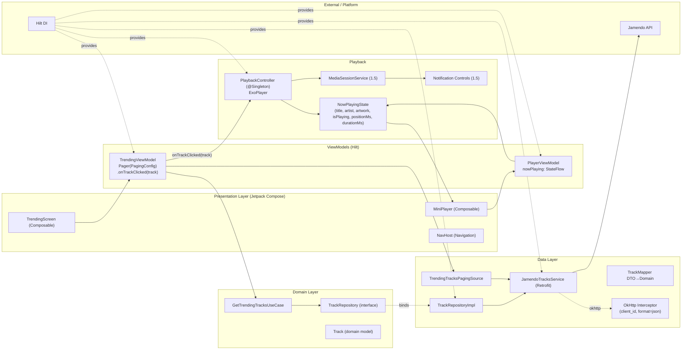
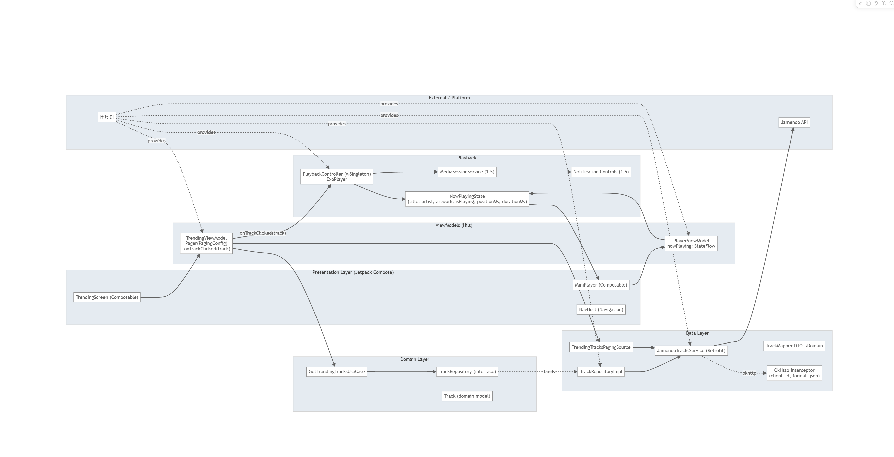

# MyMusic — Architecture Overview (Onboarding)

## Summary
- Architecture: Clean Architecture + MVVM + Hilt DI
- Layers: Presentation (Compose), Domain (models/repos/use cases), Data (Retrofit/DTO/Mapper/Paging), Playback (Media3)
- Current status: Trending list + Paging, Tap‑to‑Play + Mini‑player with progress/seek, DI/network set up

## System Diagram (Mermaid)


## Key Libraries
- UI: Jetpack Compose (Material 3, Navigation)
- DI: Hilt
- Network: Retrofit + OkHttp + Kotlinx Serialization (Json)
- Paging: Paging 3 (runtime + compose)
- Media: Media3 (ExoPlayer, Session)
- Images: Coil

## Directory Structure (key paths)
- `presentation/home/trending`: UI list & ViewModel
- `presentation/player`: MiniPlayer & PlayerViewModel
- `domain`: `Track`, `TrackRepository`, `GetTrendingTracksUseCase`
- `data/remote`: Retrofit services, DTOs
- `data/mapper`: DTO→Domain
- `data/repository`: RepositoryImpl
- `data/paging`: PagingSource
- `di`: Network/Repository modules
- `playback`: PlaybackController, NowPlayingState

## Data Flow (Trending → Tap‑to‑Play)
1. `TrendingScreen` renders `LazyColumn` from `TrendingViewModel.pagingData`
2. `TrendingViewModel` uses `Pager(PagingConfig)` + `TrendingTracksPagingSource`
3. On tap, `TrendingViewModel.onTrackClicked(track)` → `PlaybackController.play(url, meta)`
4. `PlaybackController` updates `NowPlayingState`; `MiniPlayer` observes via `PlayerViewModel`

## What To Build Next (Epic 1)
- 1.5 Foreground service + MediaSession + notification (background playback)
- 1.6 Loading/Empty/Error polish + unified retry components
- 1.7 Bottom Navigation scaffold (Trending/Explore/Downloads) with Mini‑player anchored
- 1.8 Theming M3 + dark mode + a11y baseline

## Developer Guidelines
- UI only talks to ViewModel; no Retrofit in composables
- ViewModel exposes `Flow/StateFlow`; use `cachedIn`, `collectAsState`
- Keep Domain pure; Data does Retrofit/DTO/Mapper responsibilities
- DI with Hilt modules for services/repos/controllers
- A11y: provide `contentDescription`, 48dp touch targets

## Build & Run
- JDK 17 required; set `JAVA_HOME`
- Secret: `JAMENDO_CLIENT_ID` in `gradle.properties`
- Build: `./gradlew assembleDebug` (Windows: ` .\\gradlew.bat assembleDebug`)

## Viewing the diagram
- Mermaid renders on GitHub automatically. Open this file on GitHub to see the diagram.
- In local IDE, enable a Markdown Mermaid preview extension (e.g., "Markdown Preview Mermaid Support").

### Text diagram (fallback)
```
UI (Compose)
  - TrendingScreen ──► TrendingViewModel ──► UseCase ──► TrackRepository (iface)
  - MiniPlayer ◄── PlayerViewModel ◄── NowPlayingState ◄── PlaybackController (ExoPlayer)

Data
  TrackRepositoryImpl ──► JamendoTracksService (Retrofit) ──► Jamendo API
                            ▲
                 OkHttp Interceptor (client_id, format=json)

Paging
  TrendingViewModel ──► Pager(PagingConfig) ──► TrendingTracksPagingSource ──► Service

Playback flow
  TrendingScreen (tap) ──► TrendingViewModel.onTrackClicked ──► PlaybackController.play(url)
  PlaybackController ──► updates NowPlayingState ──► PlayerViewModel ──► MiniPlayer

DI (Hilt)
  provides: Service, RepositoryImpl, ViewModels, PlaybackController
```

### Rendered image (when generated)

